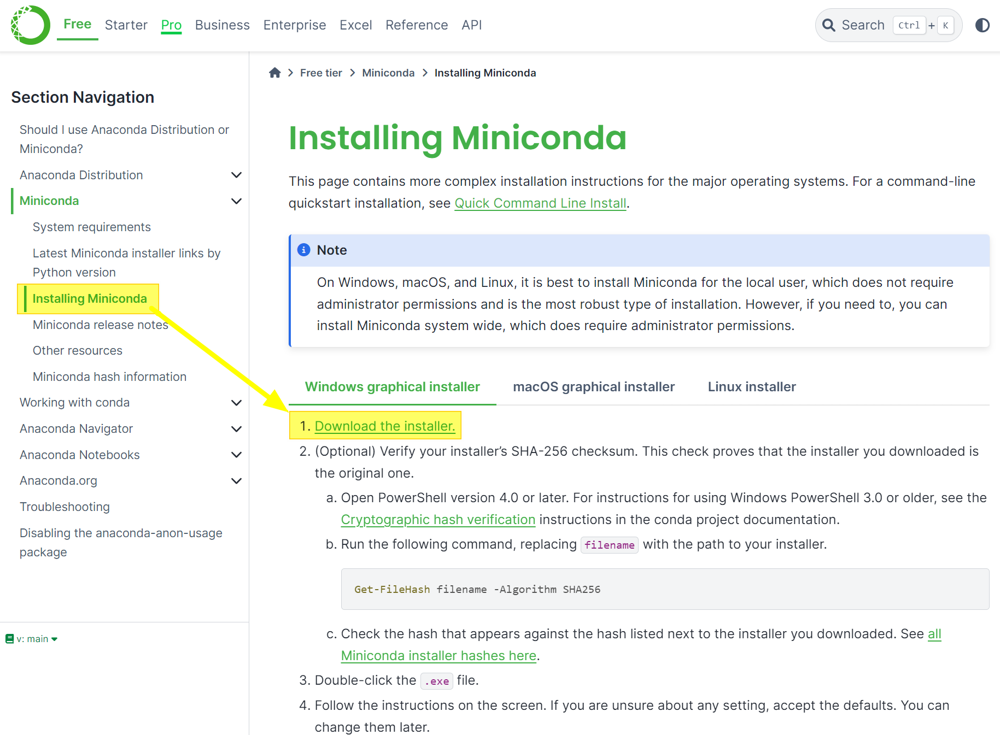
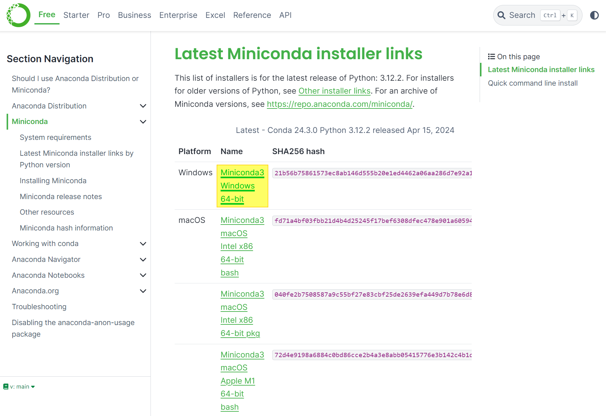

## Python 설치
파이썬을 설치하는 방법은 아래의 3가지 방법이 있습니다.
- python.org 를 방문해서 다운로드 후 설치
- anaconda 에서 제공하는 SDK 설치
- miniconda 에서 제공하는 SDK 설치

python.org 에서는 zip 파일을 다운받을수도 있고 installer를 받을수도 있고 매우 다양한 방법이 제공됩니다. 최근에는 docker 기반으로 서비스를 배포하는 경우가 많기에 굳이 python.org 에서 python 을 다운로드 받아서 설치하는 경우가 많지는 않겠지만, 경량화된 버전의 공식 python 을 설치하려면 python.org 에서 다운로드 받아서 설치합니다.<br/>

anaconda 에서는 부가적으로 설치되는 수학 라이브러리들이 많습니다. 용량도 꽤 크기에 개인적인 용도로 사용하고 싶지는 않았습니다.<br/>

이번 문서에서 사용하는 python 은 miniconda 에서 제공하는 경량화된 버전의 python 을 사용합니다.<br/>


## miniconda 방문 & python 설치

https://docs.anaconda.com/free/miniconda/index.html 에 방문합니다. 그리고 좌측의 [Miniconda → Installing Miniconda](https://docs.anaconda.com/free/miniconda/miniconda-install/) 를 클릭합니다.



<br/>


원하는 버전을 선택한 후 다운로드합니다.



이 다음부터의 설치는 설치될 경로를 제외하고 모두 기본옵션으로 설치해줬습니다.<br/>
<br/>

### 2024.04.21

현재 시점인 2024.04.21 에는 이미 python 을 제가 설치를 해뒀습니다. python.org 를 통해서 설치했던 것으로 보이고 노트북 처음 설치했을때 크롤링을 하려고 했던 건지는 모르겠지만 설치했던 듯 합니다. <br/>


## virtualenv 

> 참고
>
> - [virtualenv](https://virtualenv.pypa.io/en/latest/)
> - [installation](https://virtualenv.pypa.io/en/latest/installation.html)

<br/>


virtualenv 는 파이썬의 실행환경을 가상환경에서 실행할 수 있도록 도와주는 환경입니다. 어떤 프로젝트의 의존성이 전역적으로 설치되면 다른 프로젝트의 의존성과 충돌되기도 합니다. python 에서는 이런 문제를 해결하기 위해 virtualenv 를 통해 관리가 가능합니다. Nodejs 에서도 이런 가상환경이 있는 것으로 알고있지만 기억은 아나네요!!(ㅠㅠ)<br/>


설치

```python
python -m pip install --user virtualenv
```

이외에 다른 방법으로 설치하려면 [installation](https://virtualenv.pypa.io/en/latest/installation.html) 을 참고해주시면 됩니다. 위의 설치 방법은 virtualenv 를 전역적으로 설치하기 위한 방법입니다.<br/>


