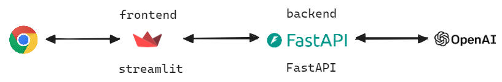

## 기본적인 구조
이번 문서에서는 어떤 구조로 예제들을 구성할지를 정리합니다. 

빠른 시일 내에 배포 관련된 챕터도 따로 예제와 함께 문서로 만들어둘 예정입니다. 

## 예제 서비스 구성

예제로 사용할 번역, 요약, 챗봇, 음성인식 등의 서비스들은 모두 아래의 구조로 작성할 예정이며, 이번 챕터에서는 모두 로컬 개발 PC 에서 구동하는 것을 전제로 합니다. 

 

