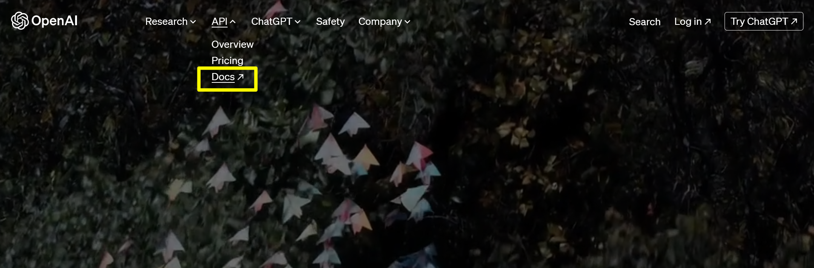
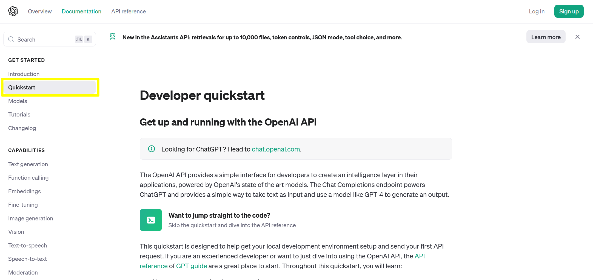
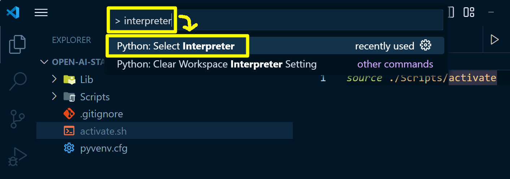
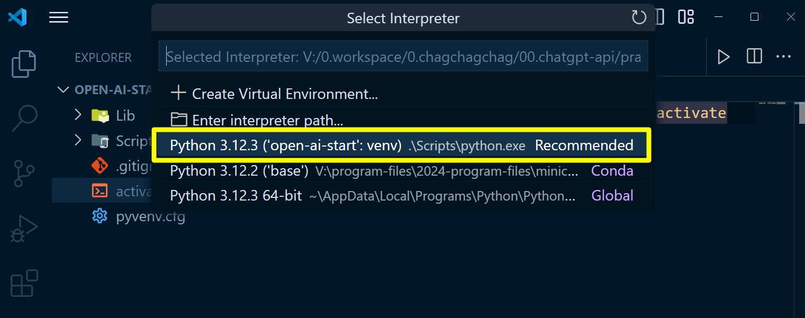
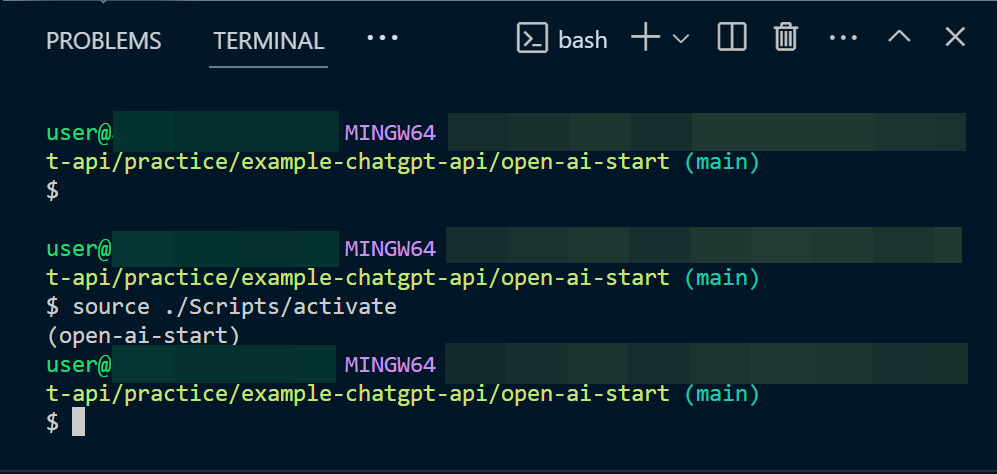
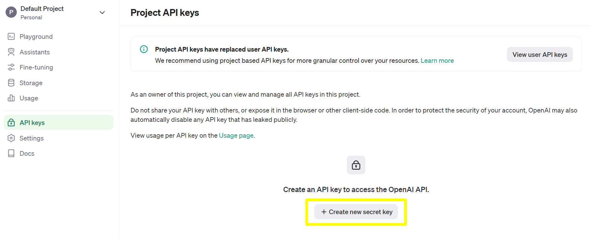
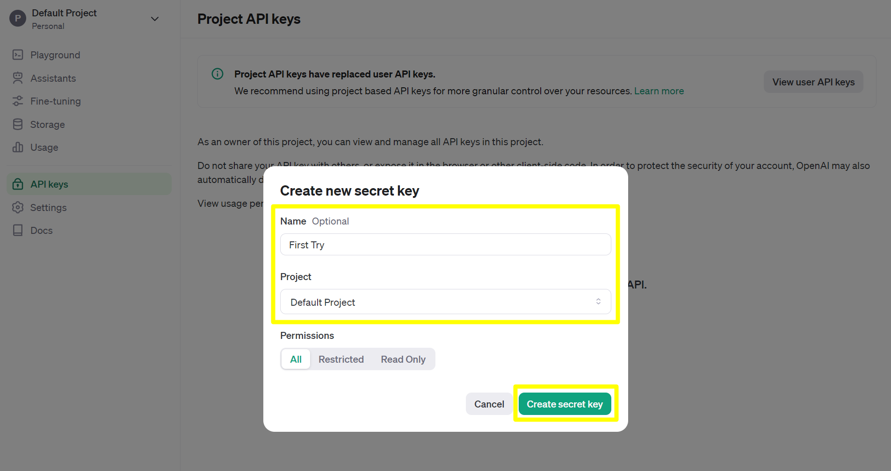
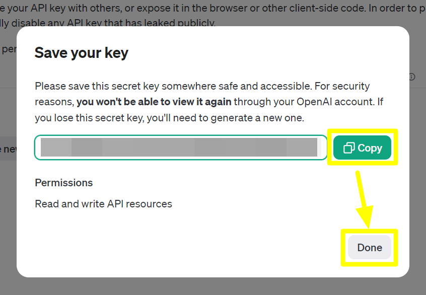
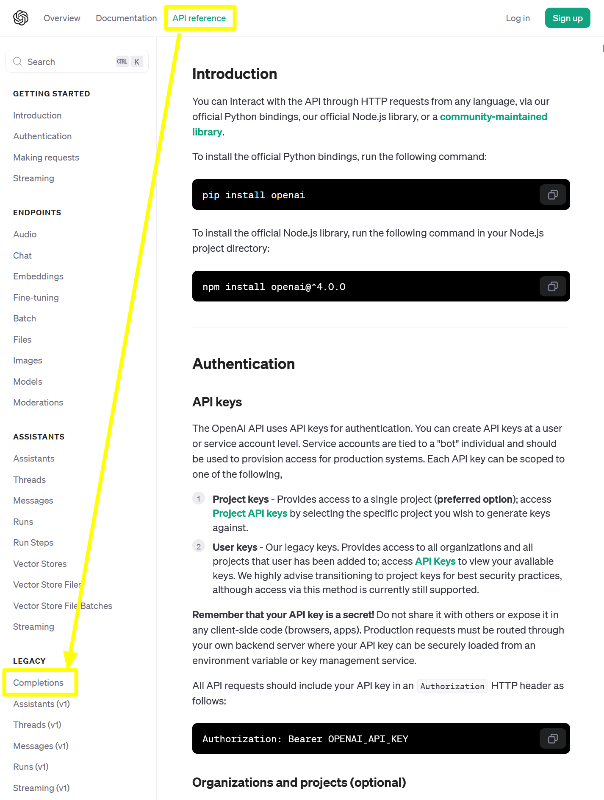

## Open AI 시작하기


## 참고

- [openai.com](https://openai.com/)
- [openai.com/docs/introduction](https://platform.openai.com/docs/introduction)
- [openai.com/docs/quickstart?context=python](https://platform.openai.com/docs/quickstart?context=python)
- [Step 2: Set up your API key](https://platform.openai.com/docs/quickstart/step-2-set-up-your-api-key)
- [Step 3: Sending your first API request](https://platform.openai.com/docs/quickstart/step-3-sending-your-first-api-request) 

<br/>


## 개발자 문서

[openai.com](https://openai.com/) 에 접속해서 API → Docs 로 메뉴 이동합니다.



<br/>


이동한 Documentaion 페이지에서는 좌측 사이드 바에서 GET STARTED → Quckstart 를 클릭합니다.



<br/>


이번 문서에서 작성하는 내용들은 대부분 위의 문서에 나온 내용들을 요약해서 적어봅니다.<br/>

<br/>


## 가상환경 생성, 파이썬 library 세팅

자세한 내용은 [Step 1: Setting up Python](https://platform.openai.com/docs/quickstart/step-1-setting-up-python) 을 참고해주세요.

```bash
## 가상환경 생성
$ virtualenv open-ai-start

## 가상환경 디렉터리로 이동
$ cd open-ai-start/

## 가상환경 activate
$ source Scripts/activate
(open-ai-start)

## openai 라이브러리 설치
$ pip install --upgrade openai
```

<br/>


vscode 에서도 가상환경을 설정해줍니다. (저는 python 에디터로 vscode 를 씁니다.)<br/>

먼저 `Ctrl + Shift + P` → `> interpreter 검색` → `Python: Select Interpreter` 선택 을 통해서 Interpreter 선택 메뉴로 이동합니다.

> 맥북에서는 `Cmd + Shift + P` 입니다.



<br/>


위에서 미리 생성해둔 virtualenv 인 `open-ai-start` 를 선택합니다.



<br/>


만약 이렇게 해도 vscode 터미널에 virtualenv 가 적용이 안된다면 아래와 같이 직접 `source ./Scripts/activate` 를 실행해주세요.



<br/>


## api key 생성

openapi.com 에 회원으로 로그인 합니다. 그리고 마이페이지로 이동합니다. 이동한 페이지에서는 `API keys` → `+Create new secret key` 를 선택합니다.



<br/>


Secret Key 를 생성하는 데에 필요한 정보들을 입력해줍니다. 그리고 `Create secret key` 버튼을 클릭합니다.



<br/>


Secret Key 를 복사해서 필요한 곳에 저장해둡니다. github 의 Environments 에 변수 등록할수도 있고, 환경변수로 등록할수는 등 여러가지 방법으로 키를 보관해두시면 됩니다. 제 경우에는 서버에 배포할게 아니기 때문에 별도의 하드디스크에 txt 파일을 생성해서 기록해두었습니다.



<br/>


## 개발PC 환경변수로 등록

> [Step 2: Set up your API key](https://platform.openai.com/docs/quickstart/step-2-set-up-your-api-key) 를 참고해주세요.

예제 문서 작성중에 계속해서 API\_KEY 를 노출시킨 코드를 주석처리하는 것은 불편하기에 개발PC에 임시적으로 환경변수로 처리해두었습니다.<br/>

아래 명령어를 통해 `OPEN_AI_KEY` 라는 환경변수를 등록합니다.

```bash 
$ export OPEN_AI_KEY=[여기에 적어주세요]
```

<br/>

이번에는 등록한 환경변수를 출력해봅니다.

```bash
$ echo ${OPEN_AI_KEY}
```

<br/>


## Completion API

> 참고 : https://platform.openai.com/docs/api-reference/completions


### model

model 에는 대표적으로 아래와 같은 것들이 있습니다. 자세한 내용은 https://platform.openai.com/docs/models/overview 을 참고해주세요.

| MODEL                                                        | DESCRIPTION                                                  |
| :----------------------------------------------------------- | :----------------------------------------------------------- |
| [GPT-4 Turbo and GPT-4](https://platform.openai.com/docs/models/gpt-4-turbo-and-gpt-4) | A set of models that improve on GPT-3.5 and can understand as well as generate natural language or code |
| [GPT-3.5 Turbo](https://platform.openai.com/docs/models/gpt-3-5-turbo) | A set of models that improve on GPT-3.5 and can understand as well as generate natural language or code |
| [DALL·E](https://platform.openai.com/docs/models/dall-e)     | A model that can generate and edit images given a natural language prompt |
| [TTS](https://platform.openai.com/docs/models/tts)           | A set of models that can convert text into natural sounding spoken audio |
| [Whisper](https://platform.openai.com/docs/models/whisper)   | A model that can convert audio into text                     |
| [Embeddings](https://platform.openai.com/docs/models/embeddings) | A set of models that can convert text into a numerical form  |
| [Moderation](https://platform.openai.com/docs/models/moderation) | A fine-tuned model that can detect whether text may be sensitive or unsafe |
| [GPT base](https://platform.openai.com/docs/models/gpt-base) | A set of models without instruction following that can understand as well as generate natural language or code |
| [Deprecated](https://platform.openai.com/docs/deprecations)  |                                                              |

<br/>


### prompt

질문을 의미합니다. 이번 문서에서 사용한 예제에서는 아래의 코드를 사용했고, prompt 에는 질문을 의미합니다.

```python
# ...

response = client.completions.create(
  model="gpt-3.5-turbo-instruct",
  prompt="Say this is a test",
  max_tokens=7,
  temperature=0
)
```

<br/>


### max_tokens

출력으로 내보낼 때 한번에 내보낼 응답의 길이를 의미합니다.<br/>

max\_tokens 가 길면 각 응답마다 내보내는 응답의 길이를 길게 내보내고 짧으면 응답마다 내보내는 응답의 길이를 짧게 내보낼 수 있습니다.<br/>

크게 잡더라도 선택한 open ai 모델 입장에서 더 짧게 생성하는게 맞다 판단할 때는 한번 응답시에 짧게 내보내는 경우도 있습니다. tokens 라는 것은 음절, 단어 등과 같은 인간 기준의 토큰 기준을 의미하는 것이 아닙니다. tokens 는 Open AI 내부적으로 사용되는 tick token 이라는 토크나이저가 있는데, 이 토크나이저가 분류한 token 을 tokens 라고 합니다.<br/>


### temperature

모델을 이용해서 출력을 내보낼 때의 Randomness 를 의미합니다. Randomness 가 낮으면 낮을 수록 같은 응답을 내보낼 확률이 높고, Randomness 가 높으면 높을 수록 다른 응답으로 내보낼 확률이 높아집니다. 즉, Temperature 가 높을 수록 다양한 답변을 내놓을 확률이 높으며 Temperature 가 낮을 수록 매번 같은 응답을 내놓을 확률이 높습니다.<br/>


### top\_p

어떤 질문에 대해 응답할 때에는 토큰 단위로 응답을 하는데 이 토큰은 10만개 정도의 토큰 데이터에서 선택을 해서 내보내게 됩니다. 이 토큰 들에는 출현확률을 의미하는 점수들이 매겨져 있는데, 이 점수가 높은 순으로 위에서부터 `Top P` 만큼을 끊어서 가져오게 됩니다. `Top_p` 라고 이름이 지어진 이유는 토큰들이 출현할 확률을 의미하는 percent 로 스코어가 매겨져 있어서 top\_p 라고 부릅니다. <br/>

쉽게 이야기하면 `top_p` 는 원하는 확률(p) 내의 범위에 존재하는 토큰들을 의미합니다.<br/>

만약 top\_p = 0.5 로 전달받았고, 토큰들은 `{0.3, 0.2, 0.1, 0.1, 0.1, 0.1, 0.1}` 로 지정되어 있을 때 가장 처음의 `{0.3, 0.2}` 의 합이 0.5 이기에 `{0.3, 0.2}` 의 출현확률을 가진 2개의 토큰을 응답으로 내보내게 됩니다.<br/>

10만개 정도의 토큰들을 저장한 배열을 백터라고 부르는데, 이 토큰 들의 스코어인 percent 를 모두 합치면 1이 됩니다.<br/>

top\_p 를 줄이면 줄일 수록 더 적은 토큰들의 범위 내에서 샘플링을 하게 됩니다.<br/>

temperature 와 동시에 사용되지는 않습니다.<br/>


### presense\_penalty, frequency_penalty

어떤 토큰이 반복적으로 나오지 않도록 패널티를 부여하는 것을 의미합니다.<br/>

<br/>


더 자세한 내용은 생략합니다.<br/>

<br/>


## API 문서 찾아보는 법

위에서는 OpenAI 의 여러 기능 중에서 Completion 이라는 기능을 사용했습니다. Completion 기능에 대한 명세는 API Reference 에서 찾아볼수 있습니다.<br/>

위에서 살펴봤던 [Quick Start](https://platform.openai.com/docs/quickstart?context=python) 페이지 상단에는 `API reference` 라는 메뉴가 있고 좌측 사이드 바의 LEGACY 메뉴를 보면 `Completion` 이라는 항목이 있습니다. `Completion` 을 클릭하면 Completion 기능에 대한 명세를 확인할 수 있습니다. <br/>




<br/>

## Comletion API : 첫 번째 예제

> 참고자료
>
> - [Step 3: Sending your first API request](https://platform.openai.com/docs/quickstart/step-3-sending-your-first-api-request) 
> - [Create completion](https://platform.openai.com/docs/api-reference/completions/create)


**first-demo.py**

```python
from openai import OpenAI
import os

key = os.getenv("OPEN_AI_KEY")
client = OpenAI(api_key = key)

response = client.completions.create(
  model="gpt-3.5-turbo-instruct",
  prompt="Say this is a test",
  max_tokens=7,
  temperature=0
)

print(f"response = {response}")
```

<br/>


출력해보면 아래와 같은 결과가 나타납니다.

```bash
$ python first-demo.py 
response = Completion(id='cmpl-9GddNSmIbqRwf7prbZNSnrRBoShZu', choices=[CompletionChoice(finish_reason='stop', index=0, logprobs=None, text='\n\nThis is a test.')], created=1713752629, model='gpt-3.5-turbo-instruct', object='text_completion', system_fingerprint=None, usage=CompletionUsage(completion_tokens=6, prompt_tokens=5, total_tokens=11))
(open-ai-start) 
```

<br/>


위의 코드에서 OpenAI 를 호출하는 부분은 아래와 같았습니다.

```python
# ...

response = client.completions.create(
  model="gpt-3.5-turbo-instruct",
  prompt="Say this is a test",
  max_tokens=7,
  temperature=0
)
```

<br/>


## Completion API : 두 번째 예제

Completion API 는 아래와 같은 예제로도 쓰일 수 있습니다.<br/>

**second-demo.py**

```python
from openai import OpenAI
import os

key = os.getenv("OPEN_AI_KEY")
client = OpenAI(api_key = key)

prompt = """
마지막 문장이 긍정적이라면 '긍정적인 기사에요' 를, 부정적이라면 '부정적인 기사에요' 를 표시해주세요.

query: 삼성중공업, 드디어 흑자전환
sentiment: 긍정적인 기사에요

query: 조선업, 달러 강세시 실적에는 조금 부정적인 영향
sentiment: 부정적인 기사에요

query: 삼성중공업, 직전 분기 흑자전환했지만, 소폭의 달러강세로 인해...
sentiment: 
"""

response = client.completions.create(
  model="gpt-3.5-turbo-instruct",
  prompt=prompt,
  max_tokens=7,
  temperature=0
)

# print(f"response = {response}")
print(response.choices[0].text)
```

> 참고로 `response['choices'][0]['text']` 와 같이 사용할 경우 아래의 에러를 접하게 됩니다.
>
> - `TypeError: 'Completion' object is not subscriptable` 
> - 참고 : [Open AI TypeError: 'Completion' object is not subscriptable](https://stackoverflow.com/questions/77461195/open-ai-typeerror-completion-object-is-not-subscriptable)


<br/>


출력결과

```bash
$ python second-demo.py 
부정적인 기사에
(open-ai-start) 
```

<br/>


한국어는 마지막 글자가 잘리는 문제가 있지만, 부정적인 기사 라고 정확하게 표기되는 것을 확인 가능합니다.

<br/>


## Completion API : 세 번째 예제 

두번째 예제와 비슷한 구조이지만 입력을 받아서 이것의 결과를 출력하는 예제입니다.

**third-demo.py**

```python
from openai import OpenAI
import os

key = os.getenv("OPEN_AI_KEY")
client = OpenAI(api_key = key)

prompt = """
마지막 문장이 긍정적이라면 '긍정적인 기사에요' 를, 부정적이라면 '부정적인 기사에요' 를 표시해주세요.

query: 삼성중공업, 드디어 흑자전환
sentiment: 긍정적인 기사에요

query: 조선업, 달러 강세시 실적에는 조금 부정적인 영향
sentiment: 부정적인 기사에요

query:  
"""

question = input("질문을 입력해주세요 >> ")

prompt = prompt + question + "\nsentiment: "

response = client.completions.create(
  model="gpt-3.5-turbo-instruct",
  prompt=prompt,
  max_tokens=7,
  temperature=0
)

# print(f"response = {response}")
print(response.choices[0].text)
```

<br/>


실행

```bash
$ python third-demo.py 
질문을 입력해주세요 >> 9년만의 흑자 순항하는 삼성중공업... 바다위 LNG 공장 히든카드
긍정적인 기사
(open-ai-start) 
```


