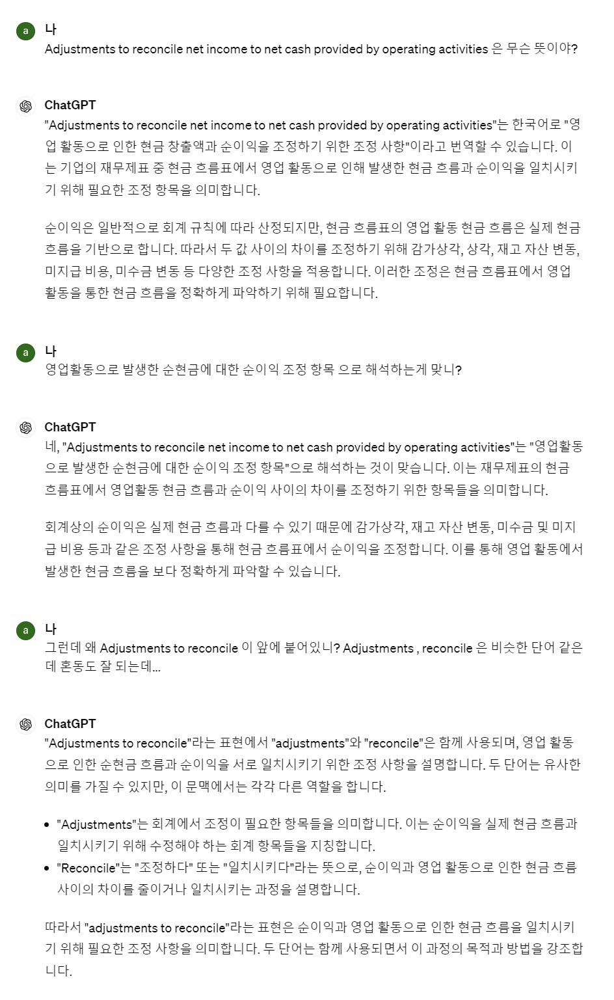

## OpenAI 의 단점

## 대표적인 사례

> 출처 : [한국일보 - "세종대왕 맥북 던짐 사건 알려줘" 물었더니... 챗GPT의 엉뚱답변 '밈'으로 유행중](https://www.hankookilbo.com/News/Read/A2023022215200000727)

 

## 개인적인 경험

### ChatGPT 는 문과적인 데이터는 꽤 좋아하는 것 같고 척척 박사

개인적으로는 정보를 요약하거나 종합하는건 정말 기가 막히다고 생각했습니다. 
영문 재무제표를 공부할 때 이 항목이 어떻게 구성되고 한국 재무제표 용어는 이렇게 표현되고, 이런 것들을 설명해줍니다. 

 

어느 정도의 암기와 이해력만 있으면 가능한 것들은 잘 조합해주는 것 같습니다. 

### 코딩 능력은 좀 많이 떨어지고, 거짓말을 좀 한다.

예전에 스프링 시큐리티의 Reactive 버전의 예제를 작성할때 초안을 ChatGPT에게 작성해달라고 하고 고쳐서 쓰려고 했는데 결국은 처음부터 다시 공식문서를 보고 다시 작성했습니다. 아마 직접 공식문서를 보고 코드를 작성했다면 더 빠르게 작업이 됐을 기억이었습니다. 

StepVerifier 문서를 작성할 때에도 StepVerifier 관련 예제를 작성하기 잠깐 귀찮아져서 초안을 작성해달라고 해서 그 코드를 보고 테스트 코드를 작성해봤는데, 이것 역시 Deprecated 된 코드를 GPT가 작성해줬었습니다. 

한편으로 최근에 copilot 이라고 해서 자동완성 기능을 GPT가 제공하는데 이 기능은 좋은 듯 해보입니다. ChatGPT는 아직 인간의 사고능력을 직접 생성해낸다기 보다는 특정 패턴에 맞게끔 자동 생성이나 추천을 하는 능력이 좋은 것 같습니다. 

 

