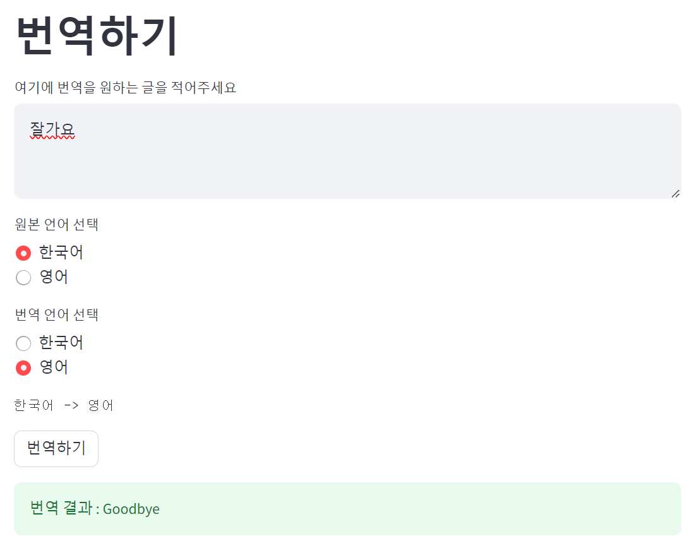

## 번역 서비스 예제

Open AI 를 조금 더 잘 쓰려면 계속해서 공부하고 원하는 답이 잘 찾아지게끔 질문을 만드는 연습이 필요하지만, 이번 문서에서는 단순한 예제 코드만 남겨보면 아래와 같습니다.<br/>


## gpt3.5 엔진 으로 작성해보기
코드는 아래와 같습니다.
```python
from openai import OpenAI
import os
import streamlit as st

key = os.getenv("OPEN_AI_KEY")
client = OpenAI(api_key = key)


st.title("번역하기")
user_input = st.text_area("여기에 번역을 원하는 글을 적어주세요", "")

src_lang = st.radio(
    "원본 언어 선택",
    ["한국어", "영어"]
)

target_lang = st.radio(
    "번역 언어 선택",
    ["한국어", "영어"]
)

def translate(input, src, target):
    todo = f"""
        src = {src_lang} 으로 쓰여진 아래의 글을 target = {target_lang}으로 번역해주세요.
        
        from: 안녕하세요
        to: Hello
        src: 한국어
        target: 영어

        from: Nice to Meet You
        to: 반가워요
        src: 영어
        target: 한국어

        src: {src_lang}
        target: {target_lang}
        from: {input}
        to: 
    """

    response = client.completions.create(
        model="gpt-3.5-turbo-instruct",
        prompt=todo,
        max_tokens=200,
        n=1,
        temperature=1
    )

    return response.choices[0]


st.text(f"{src_lang} -> {target_lang}")

flag = st.button("번역하기")

if(flag):
    response = translate(user_input, src_lang, target_lang)
    print(f"result = {response}")
    st.success(f"번역 결과 : {response.text}")
```
<br/>


실행해봅니다.

```bash
$ streamlit run chatgpt-translate.py
```

<br/>


출력결과는 아래와 같습니다.



<br/>

