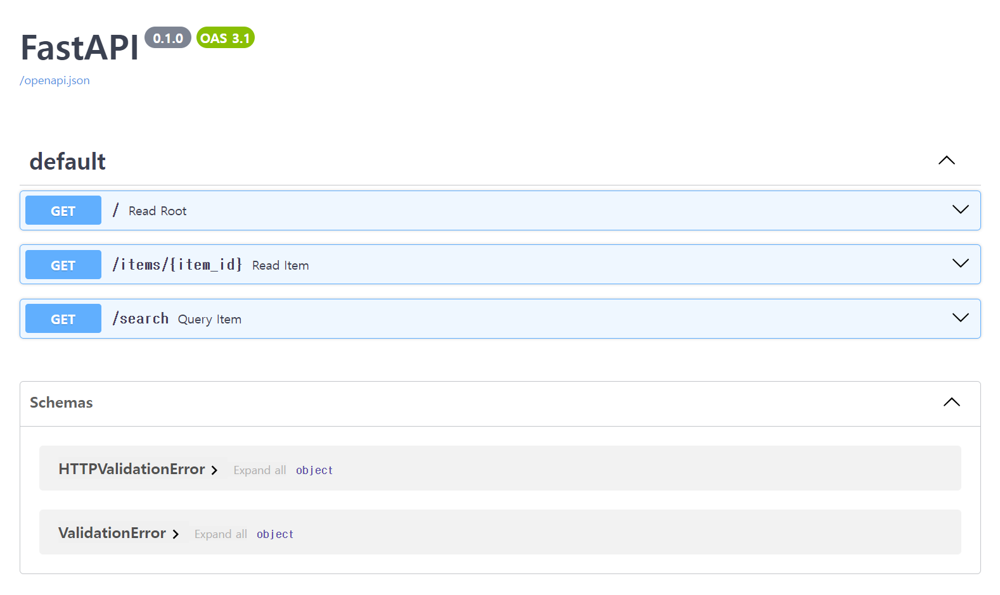

## FastAPI How To

## 참고

- [튜토리얼 - 사용자 가이드](https://fastapi.tiangolo.com/tutorial/)
- [https://fastapi.tiangolo.com/ko/](https://fastapi.tiangolo.com/ko/)

<br/>


## 설치

> 참고 : https://fastapi.tiangolo.com/ko/#_4

```bash
$ cd temp
$ virtualenv first-demo

## 가상환경 활성화
$ source first-demo/Scripts/activate

## fastapi 설치
$ pip install fastapi
$ pip install "uvicorn[standard]"

## 프로젝트 디렉터리 이동
$ cd first-demo/
$ code .
```

<br/>


## 첫 번째 예제

https://fastapi.tiangolo.com/ko/#_6 의 코드를 복사후 main.py 라는 파일을 만들어서 복사한 내용을 붙여넣어서 저장<br/>

```python
from typing import Union

from fastapi import FastAPI

app = FastAPI()


@app.get("/")
def read_root():
    return {"Hello": "World"}


@app.get("/items/{item_id}")
def read_item(item_id: int, q: Union[str, None] = None):
    return {"item_id": item_id, "q": q}

@app.get("/search")
def query_item(query: str):
    return {"your query = " + query}
```

<br/>


## 실행

> 참고 : https://fastapi.tiangolo.com/ko/#_7 

```bash
$ uvicorn main:app --reload
```

<br/>


위 명령어는 아래와 같은 의미입니다.

- main.py 라는 파일 내에 선언한 app 을 실행할 거야. 그리고 `--reload` 옵션을 통해 수정될때마다 재기동해줘 

<br/>


## `@app`

get, post, put, delete 등의 REST API 연산은 아래와 같이 `@app` 내에 정의된 데코레이션을 통해 정의 가능합니다.

- `@app.get("/")`
- `@app.get("/items/{item_id}")`
- `@app.post("/items/{item_id}")`
- `@app.put("/items/{item_id}")`
- `@app.delete("/items/{item_id}")`

POST, PUT 연산의 차이는 아래와 같습니다.

- POST : 항상 같은 결과값을 보장하지 않는 연산을 수행할 때
  - 사용자 추가, 댓글 추가 등과 같은 기존상태에서 추가되어 돌려받는 결과가 달라지는 연산들
- PUT : 항상 같은 결과값이 보장되는 멱등성 연산결과를 보장할 때
  - 사용자 정보 수정, 댓글 수정 등과 같이 한번의 요청에 대해 돌려받는 응답의 "형식"이 같을 경우 사용
  - 응답본문의 내용은 달라지지만 통신시 주고받는 데이터의 형식(상태코드 등)은 달라지지 않는다. 

<br/>


## Path Variable

Path Variable 은 예를 들면 아래와 같이 선언 가능합니다.<br/>

main.py

```python
# ...

@app.get("/items/{item_id}")
def read_item(item_id: int, q: Union[str, None] = None):
    return {"item_id": item_id, "q": q}
```

<br/>


## Query Parameter

Query Parameter 는 예를 들면 아래와 같이 선언 가능합니다.<br/>

main.py

```python
# ...

@app.get("/search")
def query_item(query: str):
    return {"your query = " + query}
```

<br/>


## API 문서

Swagger 나 Springdoc 같은 API 문서는 [http://127.0.0.1:8000/docs](http://127.0.0.1:8000/docs) 에 접속하면 확인 가능합니다.



<br/>


## EOF

저는 일반적인 개발팀 내부적으로 필요할만한 기능들을 FastAPI 와 ChatGPT 를 기반으로 제공할 수 있도록 하는 in house tool 을 만들기 위해 Fast API 를 오늘 처음 배웠는데요. 혹시라도 이 글을 읽고 계시는 분 들 중 Python 을 주력으로 사용하시려는 분들이라면 더 자세한 내용은 아래의 내용을 확인하시기 바랍니다.

- [튜토리얼 - 사용자 가이드](https://fastapi.tiangolo.com/tutorial/)
- [https://fastapi.tiangolo.com/ko/](https://fastapi.tiangolo.com/ko/)


<br/>


