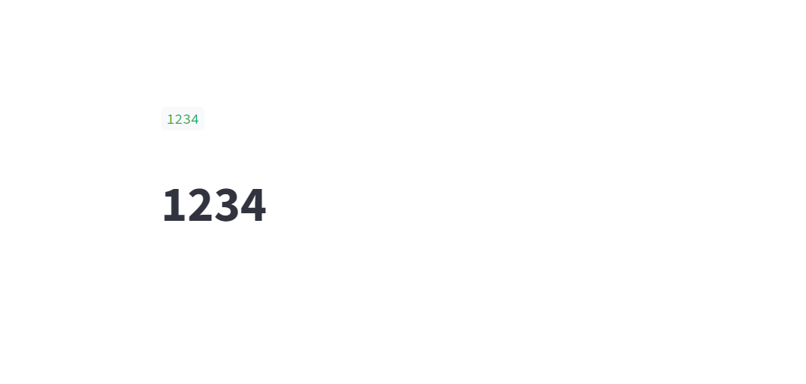
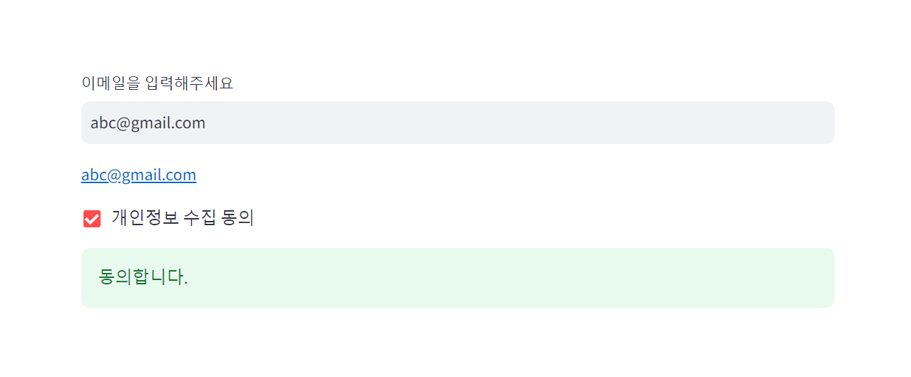
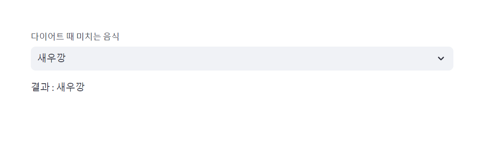
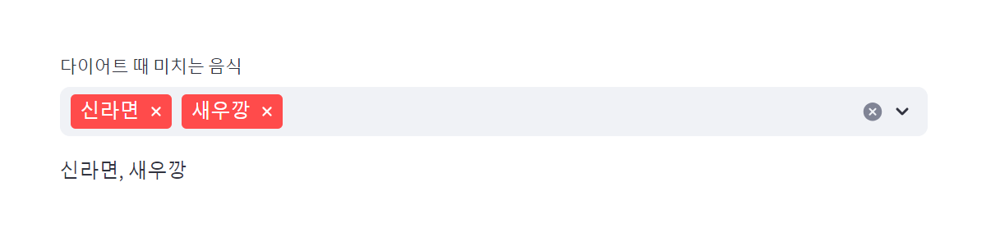
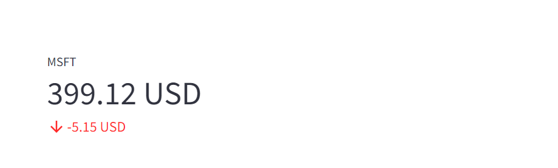

## Streamlit How To

## 설치
```bash
$ cd temp
$ virtualenv first-demo

## 프로젝트 디렉터리 이동
$ cd first-demo/
$ code .

## 가상환경 활성화
$ source ./Scripts/activate

## streamlit 설치
$ pip install streamlit
```


## 첫 번째 코드

**streamlit-demo.py**

```python
import streamlit as st

st.write(1234)
st.title("1234")
```


실행해봅니다.

```bash
$ streamlit run streamlit-demo.py
```

<br/>


실행결과는 아래와 같습니다.



<br/>


## 두 번째 코드 

이번에는 마크다운을 출력해봅니다.<br/>

**streamlit-markdown.py**

```python
import streamlit as st

"""
## 제목
### 부제
#### 소제목

- 홍길동
- 고영희
"""

```

<br/>


실행해봅니다.

```bash
$ streamlit run streamlit-markdown.py
```

<br/>


출력결과는 아래와 같습니다. 마크다운이 잘 출력되었습니다.


<br/>


## 세 번째 코드

**streamlit-gui-1.py**

```python
import streamlit as st

text = st.text_input("이메일을 입력해주세요")
st.write(text)

agreeFlag = st.checkbox("개인정보 수집 동의")
if agreeFlag:
    st.success("동의합니다.")

```

<br/>


실행해봅니다.

```bash
$ streamlit run streamlit-gui-1.py
```

<br/>


출력결과는 아래와 같습니다.



<br/>


## 네 번째 코드

**streamlit-gui-2.py**

```python
import streamlit as st

food = st.selectbox("다이어트 때 미치는 음식", {"라면", "신라면", "새우깡", "삼겹살", "피자"})
st.write(f"결과 : {food}")

```

<br/>


실행해봅니다.

```bash
$ streamlit run streamlit-gui-2.py
```

<br/>


출력결과는 아래와 같습니다.



<br/>


## 다섯 번째 코드 

**streamlit-gui-3.py**

```python
import streamlit as st

foods = st.multiselect("다이어트 때 미치는 음식", {"라면", "신라면", "새우깡", "삼겹살", "피자"})

st.write(', '.join(foods))

```

<br/>


실행해봅니다.

```bash
$ streamlit run streamlit-gui-3.py
```

<br/>


출력결과



<br/>


## 여섯 번째 코드

**streamlit-gui-4.py**

```python
import streamlit as st

st.metric(label="MSFT", value="399.12 USD", delta="-5.15 USD")
```

<br/>


실행해봅니다.

```bash
$ streamlit run streamlit-gui-4.py
```

<br/>


출력결과는 아래와 같습니다.


